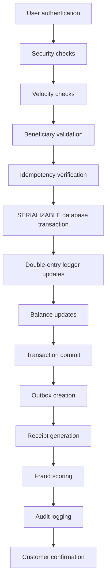
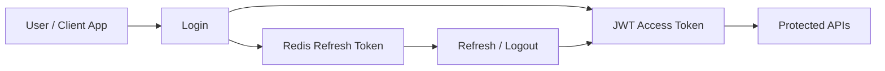
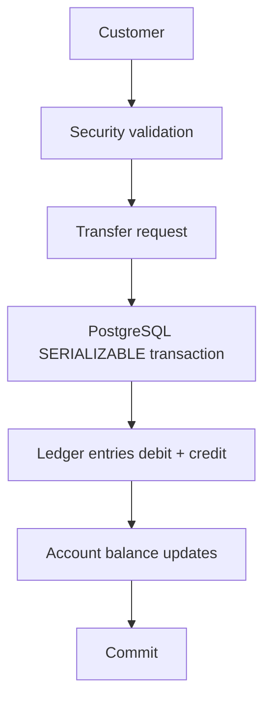
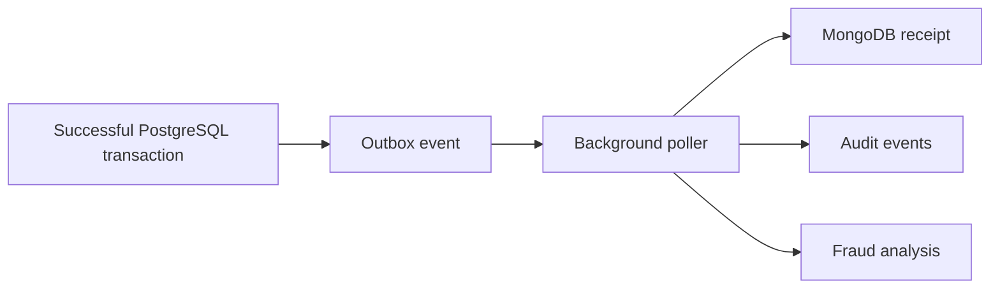
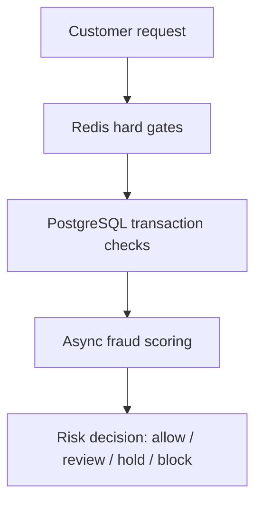
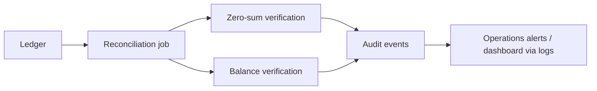
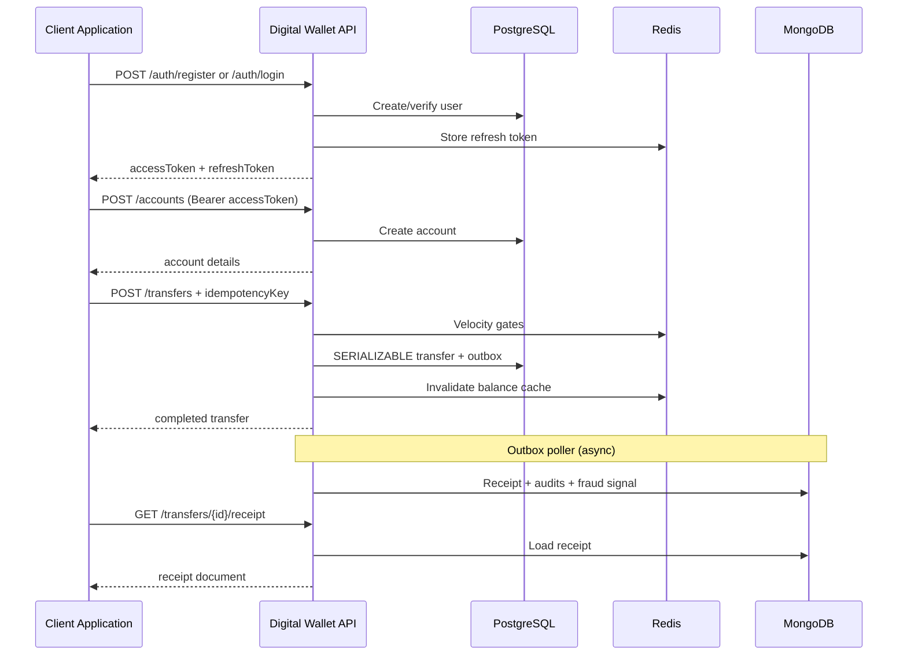
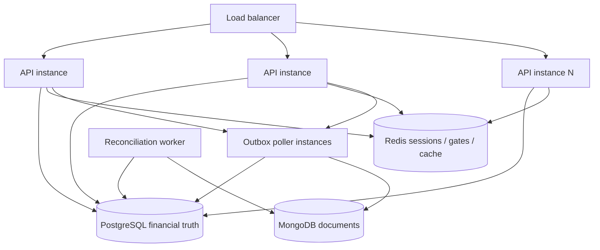
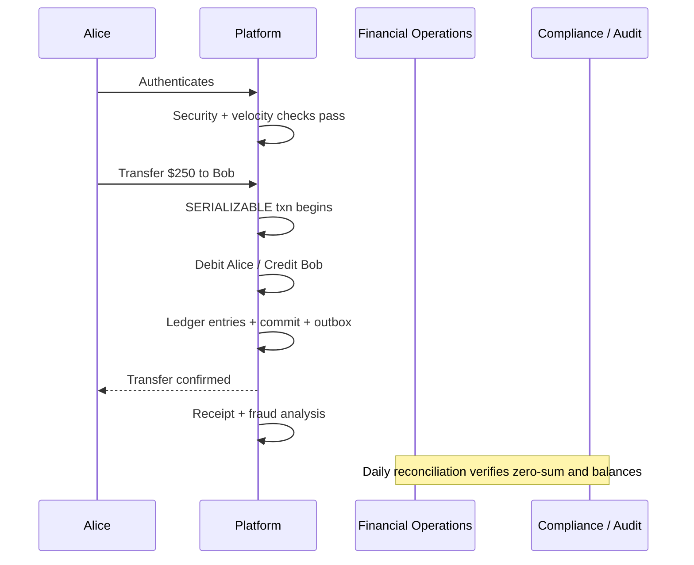

# Digital Wallet API — Platform Overview

**A production-grade fintech backend for digital accounts, money movement, ledger integrity, fraud detection, and auditability.**

*Audience: engineering managers, backend engineers, solution architects, fintech product managers, compliance teams, financial operations staff, auditors, and prospective clients evaluating the platform.*

---

## Table of Contents

1. [Executive Summary](#1-executive-summary)
2. [Business and Financial Use Cases](#2-business-and-financial-use-cases)
3. [End-to-End Transfer Lifecycle](#3-end-to-end-transfer-lifecycle)
4. [Architecture Overview](#4-architecture-overview)
5. [System Data Flow](#5-system-data-flow)
6. [Financial Integrity](#6-financial-integrity)
7. [Security and Risk Controls](#7-security-and-risk-controls)
8. [Fraud Detection](#8-fraud-detection)
9. [Customer Integration Guide](#9-customer-integration-guide)
10. [Operations and Compliance](#10-operations-and-compliance)
11. [Production Architecture](#11-production-architecture)
12. [Example Customer Journey](#12-example-customer-journey)
13. [Why This Architecture](#13-why-this-architecture)

---

## 1. Executive Summary

### The business problem

Organizations that hold or move customer money need more than a database that stores balances. They need a system that can:

- Open and manage digital accounts
- Move value between parties safely
- Prove that every change to money is complete, balanced, and attributable
- Detect abuse and fraud without blocking legitimate customers
- Produce an audit trail suitable for operations, compliance, and external review

The Digital Wallet API is a backend platform that provides that foundation. It is not a consumer banking app. It is the financial core that product teams, partners, and internal systems integrate with when they need trustworthy account and transfer behavior.

### Why financial systems need stronger guarantees

Ordinary CRUD applications optimize for convenience: create a record, update a field, delete when done. Financial systems cannot work that way.

| Ordinary application | Financial system |
|---|---|
| Updating a “balance” field is fine | Updating a balance without a matching ledger entry is a control failure |
| Duplicate submissions are annoying | Duplicate submissions can double-pay or double-charge |
| Soft deletes are acceptable | Historical money movements must remain intact |
| Eventual consistency is often enough | Concurrent transfers must not overdraw an account |
| Logs are for debugging | Audit records are evidence |

When two transfers hit the same account at the same moment, a naïve system can read the same balance twice, approve both payments, and create money that never existed. When a process crashes after updating a balance but before writing a receipt, operations may have money that moved with no customer-facing proof. These are not edge cases in fintech—they are the core design problem.

### Immutable financial records

An immutable financial record means past entries are not edited in place. Corrections, if needed, are made with new compensating entries—not by rewriting history. That property matters because:

- Auditors can reconstruct what happened at a point in time
- Disputes can be resolved from evidence, not from memory of what a balance “used to be”
- Reconciliation can compare independent views of the same truth
- Accidental or malicious alteration of history becomes detectable

In this platform, ledger entries in PostgreSQL and audit events in MongoDB are append-oriented. Audit documents are additionally protected at the application layer so updates and deletes are rejected.

### Why double-entry bookkeeping remains the foundation

Double-entry bookkeeping is older than software, and it remains the simplest reliable rule for money systems:

> **Every debit has a matching credit. Money is never created or destroyed inside the ledger.**

If Alice sends $50 to Bob, Alice’s account is debited $50 and Bob’s account is credited $50. The net change across the system is zero. Nightly reconciliation verifies that this property still holds globally and that each account’s stored balance matches the sum of its ledger history.

### Typical customers and deployment scenarios

| Customer type | How they use the platform |
|---|---|
| Fintech startups | Core wallet and transfer engine behind a mobile or web product |
| Payment platforms | Settlement between merchants, payers, and platform float accounts |
| Marketplace operators | Seller payouts, buyer wallets, escrow-style stored value |
| Employers / HR tech | Expense wallets, stipends, payroll disbursement accounts |
| Gift card / stored-value issuers | Prepaid balances with transfer and redemption flows |
| Internal treasury teams | Inter-entity movement with full ledger and audit controls |
| Banking / neobank teams | Account and ledger layer beneath product UX and card rails |

Deployment is typically as a private backend service: client applications authenticate users, call REST APIs, and rely on the platform for balances, transfers, receipts, fraud signals, and operational reporting surfaces.

### Core architectural principle

> **Money can never be created or destroyed. Every debit has a matching credit, and every financial event must be auditable.**

Every major design choice in the platform—SERIALIZABLE transfers, double-entry ledger writes, the outbox pattern, immutable audit logs, layered fraud controls, and nightly reconciliation—exists to defend that principle under concurrency, failure, and adversarial use.

---

## 2. Business and Financial Use Cases

### What the platform is

The Digital Wallet API is a **secure financial foundation**: accounts, transfers, ledgers, receipts, fraud assessment, and audit history. Product teams build the customer experience; this platform owns the money movement and the proof that money moved correctly.

### Practical applications

| Use case | Role of the platform |
|---|---|
| **Digital wallets** | Hold customer balances; move funds P2P or to merchants |
| **Banking applications** | Ledger and account state underneath deposits/withdrawals product features |
| **Payment platforms** | Transfer between payer, platform, and payee accounts with idempotent settlement |
| **Employee expense systems** | Fund expense accounts; track debits with receipts and audit events |
| **Stored-value accounts** | Prepaid balances with freeze/close lifecycle controls |
| **Gift card platforms** | Issue value into accounts; redeem via transfers |
| **Payroll systems** | Credit employee accounts from a funding account with full ledger trail |
| **Internal treasury** | Move value between corporate books with reconciliation and audit |
| **Marketplace settlements** | Split or settle marketplace proceeds between sellers and platform |
| **Fintech startups** | Launch wallet products without reinventing double-entry and fraud gates |

### What the platform deliberately is not

- Not a card network or card issuer processor
- Not a full KYC document workflow
- Not multi-currency FX conversion
- Not a consumer-facing mobile banking UI

Those capabilities sit adjacent to, or on top of, this core. The value of the platform is that adjacent systems inherit financial correctness rather than re-implementing it.

---

## 3. End-to-End Transfer Lifecycle

A successful money transfer is a carefully ordered pipeline. Each stage exists for a business reason, not only a technical one.



| Stage | What happens | Why it matters |
|---|---|---|
| **User authentication** | Client presents a short-lived JWT access token | Confirms the caller is a known user session |
| **Security checks** | Ownership of the source account; accounts must be active; currencies must match; amount must be a valid positive decimal | Prevents unauthorized or malformed money movement |
| **Velocity checks** | Redis counters limit transfers per user and new recipients per window | Stops rapid cash-out patterns before any database work |
| **Beneficiary validation** | Known recipients (prior completed transfers) bypass the new-recipient counter; new ones are rate-limited | Distinguishes normal activity from account-takeover fan-out |
| **Idempotency verification** | Client-supplied idempotency key is checked/written inside the transfer transaction | Network retries do not create duplicate payments |
| **SERIALIZABLE database transaction** | PostgreSQL runs the transfer under the strongest isolation level | Concurrent transfers cannot both spend the same funds |
| **Double-entry ledger updates** | Exactly one debit and one credit ledger entry are written | System-wide money conservation is preserved |
| **Balance updates** | Both account balances and running `balance_after` snapshots are updated | Operational reads and historical reconstruction stay consistent |
| **Transaction commit** | All PostgreSQL changes succeed together or roll back together | No half-applied transfers |
| **Outbox creation** | An outbox event is written in the same PostgreSQL transaction | Downstream work is durable even if the process crashes after commit |
| **Receipt generation** | Background poller writes a rich MongoDB receipt | Customers and support get denormalized proof of payment |
| **Fraud scoring** | Async scorer evaluates multiple risk signals | Deep analysis does not slow the money path |
| **Audit logging** | Immutable debit/credit audit events are recorded | Compliance and investigations have an append-only trail |
| **Customer confirmation** | API returns the completed transfer; clients can fetch receipt/status | The product experience can confirm success with certainty |

**Business takeaway:** financial truth is committed first and completely; enrichment (receipts, fraud documents, some audits) follows safely without risking a partial money movement.

---

## 4. Architecture Overview

```
HTTP request  → Express (routes → controllers → services)
                     │
          ┌──────────┴──────────┐
          ▼                     ▼
    PostgreSQL              MongoDB
  (users, accounts,      (receipts, audit
   transfers, ledger,     events, fraud
   outbox events)         signals)
          │
          └── Outbox poller (every 5 s) ──► MongoDB writes
                    │
                Redis
          (balance cache, refresh
           tokens, rate limits,
           velocity counters)
```

| Component | Responsibility | Business value |
|---|---|---|
| **Express API** | Authenticated REST surface for auth, accounts, transfers, ledger, health | Stable integration contract for products and partners |
| **PostgreSQL** | Users, accounts, balances, transfers, ledger entries, outbox events; ACID financial writes | Source of truth for money |
| **Redis** | Refresh tokens, velocity gates, balance cache | Fast security controls and read performance without weakening the ledger |
| **MongoDB** | Receipts, immutable audit events, fraud signal documents | Flexible, append-oriented operational and compliance records |
| **Outbox Poller** | Reads unprocessed outbox rows and writes MongoDB side effects | Survives crashes between financial commit and document enrichment |
| **Fraud Detection Pipeline** | Hard gates + in-transaction limits + async scoring | Reduces loss while protecting customer experience |
| **Reconciliation Service** | Nightly zero-sum and balance-vs-ledger verification | Independent control that money still balances |
| **Structured Logging** | Pino logs with correlation IDs and financial identifiers | Incident response and operational forensics |
| **Swagger** | OpenAPI UI in non-production environments | Faster integration and contract review during development |

### Technology choices (summary)

| Layer | Choice | Rationale |
|---|---|---|
| Server | Node.js, Express | Clear request/response API boundary |
| Relational DB | PostgreSQL via Knex | Explicit SQL for financial correctness |
| Documents | MongoDB via Mongoose | Flexible schemas + immutability hooks |
| Cache / gates | Redis | Low-latency counters and sessions |
| Money math | `decimal.js` + `DECIMAL(18,8)` | Avoid floating-point drift |
| Auth | JWT + Redis refresh rotation | Short-lived access, revocable sessions |

---

## 5. System Data Flow

### Diagram 1 — User Authentication



**How authentication protects customer accounts**

1. The user authenticates with credentials.
2. The platform issues a short-lived access token (15 minutes) and a refresh token stored in Redis.
3. Protected APIs require a valid access token.
4. Refresh rotates tokens: the old refresh token is revoked and a new pair is issued.
5. Failed login attempts are counted per account and per IP; repeated failures lock the account and rate-limit the IP.

This design limits the blast radius of stolen tokens (short access TTL + rotation) and slows credential stuffing (lockout + IP velocity).

---

### Diagram 2 — Money Transfer



**How the system guarantees financial consistency**

Inside one SERIALIZABLE transaction the platform:

1. Checks the idempotency key (return existing transfer if already processed)
2. Locks both accounts in a deterministic ID order (deadlock prevention)
3. Confirms both accounts are active and funds are sufficient
4. Enforces the account’s daily debit limit
5. Updates both balances
6. Writes the transfer row and two ledger entries
7. Writes an outbox event
8. Commits—or rolls back everything on conflict/failure

Either the full financial effect exists, or none of it does.

---

### Diagram 3 — Outbox Workflow



**Why non-financial work is separated**

PostgreSQL and MongoDB do not share one distributed transaction. If the API wrote to both during the request and crashed between them, money could move without a receipt—or a receipt could appear without a committed transfer.

The outbox pattern solves that:

- The outbox row is written **inside** the financial transaction
- After commit, a poller processes it with `FOR UPDATE SKIP LOCKED`
- MongoDB writes use idempotent upserts so retries are safe

Financial correctness remains synchronous and strict. Receipts, fraud documents, and related audits are durable and eventually consistent with that truth.

---

### Diagram 4 — Fraud Detection Pipeline



| Layer | Timing | Contribution to risk reduction |
|---|---|---|
| **Layer 1 — Redis hard gates** | Before any DB work | Blocks burst abuse and new-recipient cash-out patterns immediately |
| **Layer 2 — Transaction checks** | Inside SERIALIZABLE transfer | Enforces daily limits and account state with authoritative balances |
| **Layer 3 — Async scoring** | After commit via outbox | Detects subtle patterns (funnels, post-reset activity, large relative amounts) for ops review |

Layered detection means obvious attacks fail fast, while deeper analysis does not add latency to legitimate transfers.

---

### Diagram 5 — Daily Reconciliation



**Why reconciliation is essential**

Application logic aims to keep money correct. Reconciliation assumes bugs, partial deploys, or operational mistakes can still happen—and independently verifies the two invariants that must never break:

1. **Global zero-sum:** total credits − total debits = 0 across the ledger
2. **Per-account consistency:** each account’s stored balance equals the net of its ledger entries

Failures are logged at fatal severity and recorded as daily-deduped audit events (`GLOBAL_LEDGER_IMBALANCE`, `RECONCILIATION_FAILURE`). The job detects and alerts; it does not silently rewrite history.

---

## 6. Financial Integrity

### Double-entry bookkeeping (plain language)

Think of every transfer as two sides of the same story:

- A **debit** records money leaving an account
- A **credit** records money entering an account

Both sides are written together. If either side is missing, the books no longer balance—and the system treats that as a defect, not a valid state.

### Simple example

Alice has $200. Bob has $100. Alice sends $50 to Bob.

| Account | Entry type | Amount | Balance after |
|---|---|---|---|
| Alice | Debit | $50.00 | $150.00 |
| Bob | Credit | $50.00 | $150.00 |

**Net change across the system:** −$50 + $50 = **$0**

That zero-sum property is what nightly reconciliation re-checks across every entry in the ledger.

### Debit and credit relationships

| From the account’s perspective | Ledger type | Effect on balance |
|---|---|---|
| Money leaving | Debit | Balance decreases |
| Money arriving | Credit | Balance increases |

In this wallet model, accounts behave like liability-style customer wallets: credits increase what the platform owes the customer; debits decrease it. Product language says “send” and “receive”; the ledger language says debit and credit.

### Immutable ledgers

Ledger entries are historical facts. The platform does not “edit yesterday’s balance.” If a reversal is required in a future capability, it would appear as new compensating entries linked to a reverse transfer—not as mutation of past rows. That preserves reconstructability for auditors and disputes.

### Running balances

Each ledger entry stores `balance_after`—a snapshot of the account balance immediately after that entry. Ledger APIs can also compute a running balance over a page of history with SQL window functions. The stored snapshot remains the authoritative point-in-time value written during the transfer.

### Financial precision and decimal arithmetic

Binary floating point (`0.1 + 0.2`) is unsafe for money. The platform uses:

- PostgreSQL `DECIMAL(18,8)` for storage
- `decimal.js` for application arithmetic
- String amounts on the API (never JSON numbers for money)

This prevents cumulative rounding errors across high transfer volumes.

### SERIALIZABLE transactions

`SERIALIZABLE` is PostgreSQL’s strongest isolation level. It ensures concurrent transfers behave as if they ran one after another. If two transfers conflict on the same balances, one is aborted and retried (up to three attempts). This is slower than weaker isolation—and deliberately so—because preventing overdrafts and double-spends matters more than maximizing raw throughput.

### Idempotent transfers

Clients must supply an `idempotencyKey` with every transfer. If the network retries a successful request, the platform returns the original transfer instead of moving money again. The key is enforced with a unique database constraint and checked inside the same transaction as the money movement.

### Account state management

Accounts follow a controlled lifecycle:

```
active  → frozen → active
active / frozen → closed   (closed is terminal; balance must be zero)
```

Frozen accounts cannot send or receive. Closed accounts cannot reopen. These rules prevent transfers into unusable states and orphaned non-zero balances on closure.

---

## 7. Security and Risk Controls

| Control | Mechanism | Protects against |
|---|---|---|
| **JWT authentication** | Short-lived access tokens (15 min) | Long-lived stolen session use |
| **Refresh token rotation** | Redis-backed refresh tokens revoked on each refresh/logout | Replay of stolen refresh tokens |
| **Password hashing** | bcrypt with 12 rounds | Credential database exposure |
| **Account lockout** | 10 consecutive failures → 30-minute lock; `LOGIN_LOCKED` audit | Password guessing against one account |
| **IP velocity protection** | 10 failed logins / 5 minutes per IP before password compare | Credential stuffing across many accounts |
| **Transfer velocity limits** | 20 transfers / 10 minutes per user | Rapid automated draining |
| **Beneficiary velocity controls** | 3 new recipients / 10 minutes (known recipients exempt) | Account-takeover cash-out fan-out |
| **Admin authorization** | Live database role check on each admin request | Stale elevated privileges in JWTs |
| **Correlation IDs** | Per-request UUID on logs and response headers | Cross-service incident tracing |
| **Immutable audit logs** | MongoDB audit events with middleware blocking update/delete | Tampering with the compliance trail |

### Account takeover and abuse narrative

Attackers who steal credentials often try many passwords from many IPs, then rapidly send funds to new destinations. The platform’s controls map to that pattern:

1. IP velocity slows bulk guessing
2. Account lockout stops sustained attacks on one user
3. Short JWTs + refresh rotation limit session theft windows
4. Transfer and new-beneficiary gates interrupt cash-out bursts
5. Async fraud scoring flags post-reset transfers and destination funnels for review

Security here is layered: no single control is assumed sufficient.

---

## 8. Fraud Detection

### Strategy overview

| Phase | Name | Goal |
|---|---|---|
| **Preventive** | Redis hard gates | Stop obvious abuse before money moves |
| **Transaction-time** | In-transaction validation | Enforce limits using locked, authoritative balances |
| **Post-transaction** | Async fraud scoring | Detect nuanced risk without delaying legitimate customers |

### Fraud signals (async layer)

| Signal | Meaning | Typical severity cues |
|---|---|---|
| **Transfer velocity** | How many transfers the sender made in the last 10 minutes | Higher counts → higher severity |
| **Large amount detection** | Transfer size relative to the account’s daily limit | ≥50% medium; ≥80% high |
| **New recipient monitoring** | First-time destination for this sender | Medium when first-ever path |
| **Destination funnel analysis** | Many distinct senders paying one recipient in 30 minutes | AML-style concentration indicator |
| **Recent password reset activity** | Transfer soon after a password reset timestamp | High within 10 minutes; medium within 60 |

### Risk decisioning

Signal severities map to weights (low 10 / medium 25 / high 40). The sum drives a decision:

| Decision | Score range | Operational intent |
|---|---|---|
| **allow** | &lt; 30 | Normal risk |
| **review** | 30–65 | Queue for human or rules review |
| **hold** | 65–100 | Elevated intervention posture |
| **block** | ≥ 100 | Highest risk tier |

Admin users can retrieve the fraud signal document for a transfer for investigation workflows.

### Balancing experience and security

Hard gates are few, fast, and predictable—so honest customers rarely notice them. Expensive graph-like and historical checks run after commit, so they do not add seconds to every payment. That separation is how the platform protects funds without making everyday transfers feel like a compliance interrogation.

---

## 9. Customer Integration Guide

### Integration sequence (happy path)



### Capability map

| Capability | Typical endpoints | Notes |
|---|---|---|
| **User registration** | `POST /api/v1/auth/register` | Returns token pair |
| **Authentication** | `POST /api/v1/auth/login`, `/refresh`, `/logout` | Rotate refresh tokens; logout is idempotent |
| **Account management** | `POST/GET /api/v1/accounts`, freeze/unfreeze/close | State machine enforced server-side |
| **Transfers** | `POST /api/v1/transfers` | Requires idempotency key; amounts as strings |
| **Idempotency keys** | Client-generated UUID per logical transfer | Safe retries |
| **Transaction history** | `GET /api/v1/accounts/:id/ledger` | Cursor pagination |
| **Balance queries** | `GET /api/v1/accounts/:id` | Redis cache with write invalidation |
| **Receipts** | `GET /api/v1/transfers/:id/receipt` | Available after outbox processing |
| **Fraud / admin review** | `GET /api/v1/transfers/:id/fraud-signal` | Admin role required |
| **Account summary** | Daily credits/debits/net over a date range | Operations and product analytics |

### Transfer request shape

```json
{
  "fromAccountId": "uuid",
  "toAccountId": "uuid",
  "amount": "250.00",
  "currency": "USD",
  "description": "Invoice 1042",
  "idempotencyKey": "client-generated-uuid"
}
```

### Auth for protected calls

```
Authorization: Bearer <access_token>
```

### Response envelope

```json
{
  "success": true,
  "statusCode": 200,
  "data": {},
  "error": null
}
```

### Health for orchestrators

| Endpoint | Purpose |
|---|---|
| `GET /health` | Liveness |
| `GET /health/ready` | Readiness for PostgreSQL, MongoDB, and Redis |

Swagger UI is available at `/swagger` in non-production environments for contract exploration.

---

## 10. Operations and Compliance

| Capability | What operators / auditors get |
|---|---|
| **Transaction history** | Cursor-paginated ledger with running balances |
| **Ledger inspection** | Per-transfer debit/credit pairs and `balance_after` snapshots |
| **Account summaries** | Daily aggregated credits, debits, and net over a date range |
| **Fraud monitoring** | Per-transfer fraud signal documents with scores and signal details |
| **Reconciliation reports** | Fatal logs + audit events when invariants fail |
| **Audit trails** | Append-only MongoDB events for logins, account lifecycle, transfers, reconciliation |
| **Administrative controls** | Admin role for fraud signal access; live role enforcement |
| **Structured logging** | Correlation IDs plus `userId` / `accountId` / `transferId` fields |
| **Operational dashboards** | Built by feeding structured logs and audit/fraud documents into the organization’s monitoring stack |

### Supporting regulatory and review workflows

While the platform does not claim to be a complete regulatory reporting product, it provides the raw materials reviewers typically need:

- **Who** acted (`actorId`, IP, user agent where captured)
- **What** changed (`eventType`, payload snapshot)
- **When** it happened (`createdAt`)
- **Whether money still balances** (reconciliation invariants)
- **Whether a transfer looked risky** (fraud signals and decisions)

Immutable audit storage and ledger immutability are intentional compliance-oriented design choices: evidence should accumulate, not be rewritten.

---

## 11. Production Architecture

### Scaling model



| Concern | Approach |
|---|---|
| **Horizontal API scaling** | Stateless API instances behind a load balancer |
| **PostgreSQL transaction guarantees** | Centralized financial writes under SERIALIZABLE |
| **Redis performance** | Velocity gates and balance cache offload hot reads/checks |
| **MongoDB document storage** | Receipts, audits, fraud docs scale independently of ledger writes |
| **Background workers** | Outbox poller every 5s; reconciliation on a daily (or configured) interval |
| **Workload separation** | Critical money path ≠ enrichment path |

### Why financial writes stay centralized

Money correctness depends on one strongly consistent ledger. Horizontal API scaling increases request capacity, but concurrent transfers still serialize through PostgreSQL’s transaction engine where conflicts are detected and resolved safely.

### Why async processing improves performance

Receipt generation, fraud scoring, and some audit enrichment are important—but they are not what makes a transfer financially valid. By moving them behind the outbox:

- Transfer latency stays dominated by the financial transaction
- Document stores can evolve schemas without migrations on the money tables
- Pollers can be scaled and retried independently
- Crashes after commit do not lose the obligation to write side effects

---

## 12. Example Customer Journey

### Scenario: Alice transfers $250 to Bob

**Starting balances:** Alice $1,000 · Bob $400

#### Lifecycle



#### Ledger movement

| Step | Alice | Bob | System net |
|---|---|---|---|
| Before | $1,000 | $400 | — |
| Debit Alice $250 | $750 | $400 | −$250 |
| Credit Bob $250 | $750 | $650 | $0 |

#### Perspectives

| Stakeholder | What they experience / observe |
|---|---|
| **Customer (Alice)** | Logs in, sends $250, receives confirmation; can later view receipt and ledger history |
| **Platform** | Authenticates; passes velocity gates; locks accounts; writes double-entry + outbox; commits; invalidates caches; async poller writes receipt, audits, fraud signal |
| **Financial operations** | Sees completed transfer, balances, daily summary aggregates; relies on reconciliation alerts if invariants ever fail |
| **Compliance / auditing** | Sees login and transfer-related audit events, immutable history, optional fraud signal decisioning for investigation |

Every step leaves either a financial fact (PostgreSQL) or an operational/compliance fact (MongoDB/logs)—or both.

---

## 13. Why This Architecture

### Principles

| Principle | Expression in the platform |
|---|---|
| **Correctness over raw performance** | SERIALIZABLE transfers; retries on serialization failure |
| **Financial integrity above convenience** | No balance edits without ledger companions |
| **Strong transactional consistency** | Single PostgreSQL transaction for money + outbox |
| **Immutable auditability** | Append-only ledger posture; immutable audit middleware |
| **Separation of critical and non-critical workloads** | Outbox for receipts/fraud enrichment |
| **Layered fraud prevention** | Gates → transaction checks → async scoring |
| **Operational transparency** | Correlation IDs, structured logs, reconciliation fatal alerts |
| **Recoverability** | Idempotent Mongo upserts; poller retries unprocessed events |
| **Regulatory readiness** | Traceable actors, timestamps, payloads, and independent balance proofs |

### Explicit trade-offs

| Decision | Cost | Why it is appropriate |
|---|---|---|
| **SERIALIZABLE isolation** | Lower concurrency throughput; occasional retries | Prevents lost-update overdrafts under contention |
| **Outbox + async receipts** | Brief delay before receipt/fraud docs appear | Avoids dual-write corruption across Postgres and Mongo |
| **Immutable ledgers / audits** | Corrections require compensating events, not edits | Preserves evidence quality for disputes and audits |
| **Decimal strings on the API** | Slightly less convenient for naïve clients | Eliminates floating-point money bugs at the boundary |
| **Redis gates before DB** | Extra infrastructure dependency | Cheaply stops abuse without burning database capacity |
| **Live admin role checks** | Extra query per admin call | Privilege changes take effect immediately |

### Closing statement

The Digital Wallet API treats money as a system of record, not as a mutable field. It assumes concurrency, retries, crashes, and adversaries—and designs for those conditions explicitly. For engineering teams, that means a clear transactional core. For financial operations and compliance, it means balances that can be proven. For product and partner organizations, it means a foundation safe to build customer experiences on.

> **Money can never be created or destroyed. Every debit has a matching credit, and every financial event must be auditable.**

That constraint is not a slogan at the edge of the design. It is the design.

---

## Appendix A — Component & Data Reference

### PostgreSQL tables (financial truth)

| Table | Purpose |
|---|---|
| `users` | Identity, credentials, lockout, role, password-reset timestamp |
| `accounts` | Balances, currency, status, daily limit, version |
| `transfers` | Transfer header with unique idempotency key |
| `ledger_entries` | Debit/credit entries with `balance_after` |
| `outbox_events` | Durable async work queue |

### MongoDB collections (operational / compliance documents)

| Collection (model) | Purpose |
|---|---|
| Transaction receipts | Customer-facing enriched proof of payment |
| Audit events | Immutable system activity log |
| Fraud signals | Per-transfer risk assessment |

### Redis responsibilities

| Use | Example key pattern |
|---|---|
| Refresh sessions | `refresh:{userId}:{tokenId}` |
| Balance cache | `balance:{accountId}` |
| Transfer velocity | `ratelimit:transfer:{userId}` |
| Login IP velocity | `velocity:failed-login:ip:{ip}` |
| New beneficiary velocity | `velocity:new-beneficiary:{userId}` |

---

## Appendix B — API Surface (summary)

All business APIs are prefixed with `/api/v1`.

| Area | Methods |
|---|---|
| Auth | register, login, refresh, logout |
| Accounts | create, list, get, freeze, unfreeze, close, ledger, summary |
| Transfers | initiate, get, receipt, fraud-signal (admin) |
| Health | `/health`, `/health/ready` |

For environment setup, migrations, and detailed request/response contracts, see the project [README](../README.md).

---

*Document version: aligned with the implemented Digital Wallet API architecture (authentication, accounts, SERIALIZABLE double-entry transfers, outbox, fraud layers, reconciliation, health checks).*
